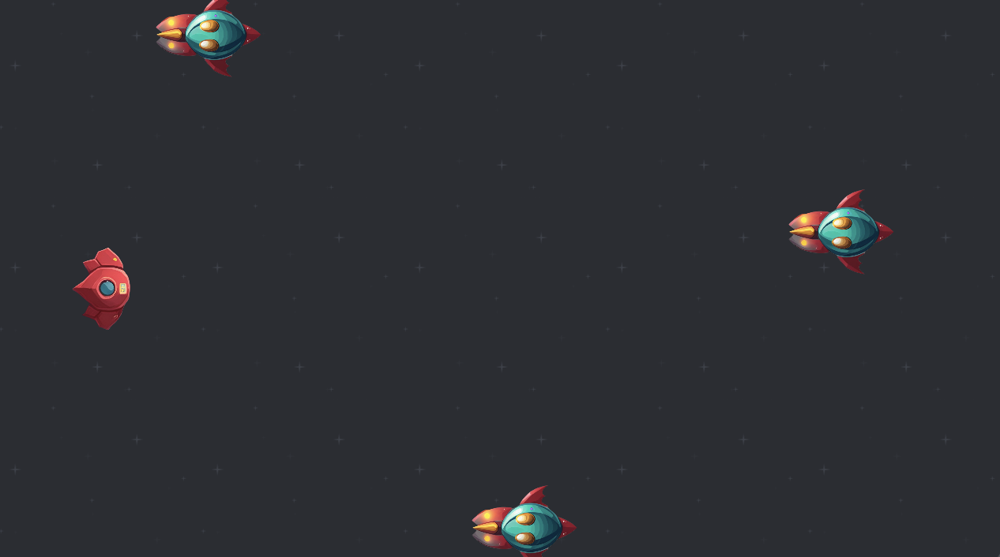

# Alien Attack

A small 2D game for me to learn Godot 4 made by following the GameDev.tv tutorial about making 2D games using Godot 4. It can be controlled by the arrow keys, the WASD keys, or a controller d-pad. In this game you control a ship that can shoot rockets to destroy enemy ships. You have three lives to start. You gain points by destroying enemy ships, and loose lives by letting enemy ships touch you, or letting them past you.

### Controls

| Action | Keyboard Button | Controller Button |
|--------|-----------------|-------------------|
| Move Left | 'A' or Left Arrow | Left D-Pad |
| Move Right | 'D' or Right Arrow | Right D-Pad |
| Move Up | 'W' or Up Arrow | Up D-Pad |
| Move Down | 'S' or Down Arrow | Down D-Pad |
| Shoot | Space | B Button |

